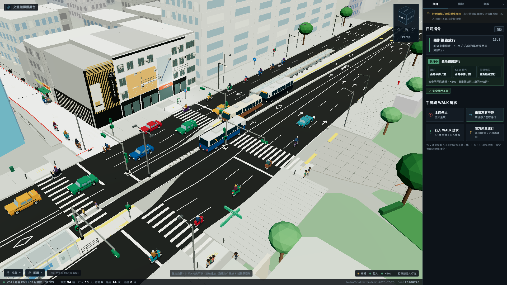

# 公館商圈數位孿生 — 機器人交通指揮模擬

台北公館路口(羅斯福路 × 舟山路 × 巷90)的數位孿生,一台人形機器人 KBot
站在路口指揮交通。場景來自實測的 Blender V54 掃描,車道、斑馬線、公車月台、
停止線全部從 GLB 幾何量出來,不是憑感覺畫的。

**純前端、零 CDN、完全離線可跑。** three.js r170,原生 ES module,無框架、無建置步驟。



---

## 跑起來

```bash
python3 serve.py --port 8124
# 開 http://localhost:8124/viewer/traffic_director.html
```

只需要 Python 3(內建 http.server 即可,`serve.py` 只是多了正確的 no-cache 標頭)。
不需要 npm install,不需要網路。

---

## 這是什麼

### 3D Viewport,不是 Dashboard

| 操作 | 手勢 |
| --- | --- |
| 旋轉 | 左鍵拖曳 |
| 平移 | Shift + 左鍵拖曳,或右鍵拖曳 |
| 縮放 | 滾輪 |
| 聚焦選取物 | 點選物件後按 `F`,或雙擊 |

- **ViewCube**(右上角):點六個面切正視角,跟著相機轉,可切 Perspective / Orthographic
- **10 個預設視角**:鳥瞰 / 等角 / 街道 / 跟隨 KBot / 路口 / 公車站 / 行穿線 / 巷90 / 正俯視 / 固定監控
- **5 種相機模式**:Orbit / Follow / Fixed / Top / Street
- **物件選取與 Frame Selected**:點 KBot、車輛、行人、公車站、路口都能平滑聚焦置中
- **6 個圖層開關**:車輛 / 行人 / KBot / 號誌 / 加畫標線 / 場景建物
- 所有視角切換都是 620 ms 的緩動過渡,沒有瞬移

### 交通模擬

- **台灣交通規則**:官方手勢子集(交通部駕駛人手冊)、機車兩段式左轉(道交條例 §99,預設關閉)、公車專用道、行人號誌
- **五相位循環**:全向停止 / 淨空 / 羅斯福路放行 / 行人穿越 / 巷90 放行,含黃燈尾段
- **KBot 三崗位勤務**:平時在人行道、行人相位走到斑馬線上指揮、巷90 相位到巷口招車。走位全程沿斑馬線畫線帶
- **安全閘門**:任何 GO 都先全停、淨空、確認動作穩定;機器人在車道上時不得放行
- **確定性生成**:seeded,同一個 seed 每次跑出同一組人車

### 全部參數可調

控制面板的「參數」分頁有 **94 個參數**,分 11 組,面板由參數登錄表自動產生。
車速、車流量、相位秒數、跟車間距、公車靠站、KBot 勤務、外觀配色、渲染設定都能即時調。

實景校準幾何(車道中心線、斑馬線走廊、月台位置)獨立一組並標明警語 —— 那些是從
GLB 量出來的實測值,改了模擬就會偏離實景。

調好的值可以:自動記在瀏覽器、匯出/匯入 JSON、複製成可貼回原始碼的片段。

---

## 專案結構

```
blender/                           Blender V54 場景原始檔(102MB,Git LFS)
viewer/
  traffic_director.html/.css/.js   主程式(場景、相機、模擬、UI)
  traffic_simulation_core.mjs      純函式:車道幾何、行人狀態機、可調常數
  traffic_params.mjs               參數登錄表:分組、序列化、localStorage
  models/                          場景 GLB、KBot GLB、號誌 GLB、行人 GLB
  vendor/                          three.js r170 + addons(離線)
traffic_rules/                     台灣交通規則 JSON(含官方出處)
mujoco/                            MuJoCo 動作烘焙管線 + node 測試 + CDP 驗收腳本
serve.py                           靜態站(正確的快取標頭)
SPEC_VIEWER_V2.md                  逐節設計紀錄 §1–§22
SPEC_MUJOCO.md                     KBot 動作管線
```

---

## Blender 原始檔(Git LFS)

`blender/gongguan_v54_traffic_director_demo.blend`(102MB)用 **Git LFS** 存放。
clone 之前要先裝好 LFS,否則拿到的會是一個指標檔而不是真的 .blend:

```bash
brew install git-lfs      # 或 apt install git-lfs
git lfs install
git clone https://github.com/Sanwanh/gongguan-traffic-director.git
```

已經 clone 過才裝 LFS 的話:

```bash
git lfs install && git lfs pull
```

**只想跑 viewer 的話不需要這個檔** —— viewer 吃的是 `viewer/models/` 裡已匯出的 GLB。
可以用 `GIT_LFS_SKIP_SMUDGE=1 git clone ...` 跳過 102MB 的下載。

---

## 開發

```bash
# 三套純函式測試
node mujoco/test_lane_rules.mjs
node mujoco/test_viewer_v3_geometry.mjs
node mujoco/test_v4_direction_and_turns.mjs

# 錄影分鏡驗收(headless Chrome CDP,約 13 分鐘,產出 8 張截圖)
node mujoco/verify_recording_shots.mjs
```

**改動 JS / CSS / GLB 之後一定要跑:**

```bash
python3 mujoco/stamp_versions.py
```

它用內容雜湊蓋 `?v=` 版本戳。不跑的話瀏覽器會吃到舊快取 —— 這個坑踩過,見 SPEC §10。

---

## KBot 動作

機器人的手勢與走路不是手 K 的關鍵影格,是 MuJoCo 3.11 位置控制動力學生成後烘焙回 GLB 的:
1067 影格手勢(RMS 0.005 rad、零自碰撞)+ 76 影格走路循環(迴圈區取模無縫)。
機器人本體來自 [ksim](https://github.com/Sanwanh/ksim) 的 kbot-headless MJCF。

管線與重跑方式見 `SPEC_MUJOCO.md`。

---

## 授權與素材出處

本專案的程式碼授權**尚未決定**(repo 目前為 private)。第三方素材:

| 素材 | 來源 | 授權 |
| --- | --- | --- |
| three.js r170 + addons | [mrdoob/three.js](https://github.com/mrdoob/three.js) | MIT |
| `pedestrian_walker.glb` | Khronos glTF-Sample-Assets(CesiumMan 衍生,已移除商標貼圖) | CC BY 4.0 |

完整的來源 URL、上游 commit、SHA256 與商標處理紀錄見 `viewer/models/ASSETS.md`。

場景 GLB 與 KBot 模型為本專案自有資產。

---

## 免責聲明

這是**封閉場域的數位孿生展示**,不是公共道路的實際交通指揮系統。
私人機器人不具法定交通指揮權。畫面中的路口幾何雖然對照實景校準,
但號誌時制、車流組成與指揮行為都是模擬,不代表該路口的真實運作。
